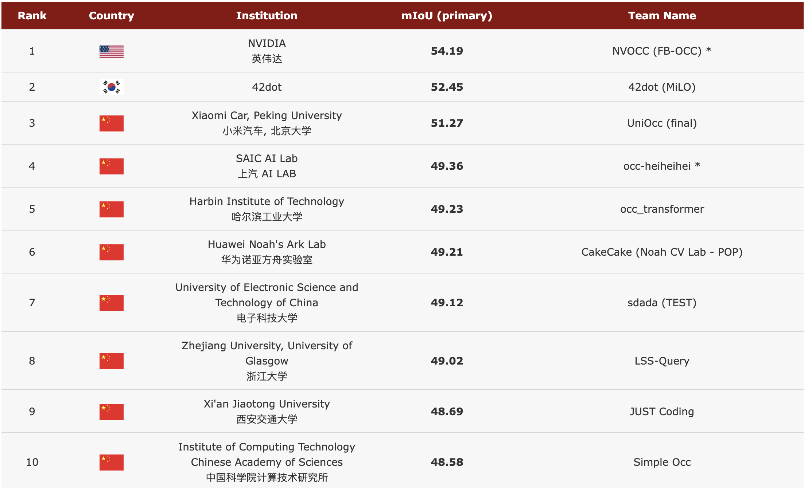
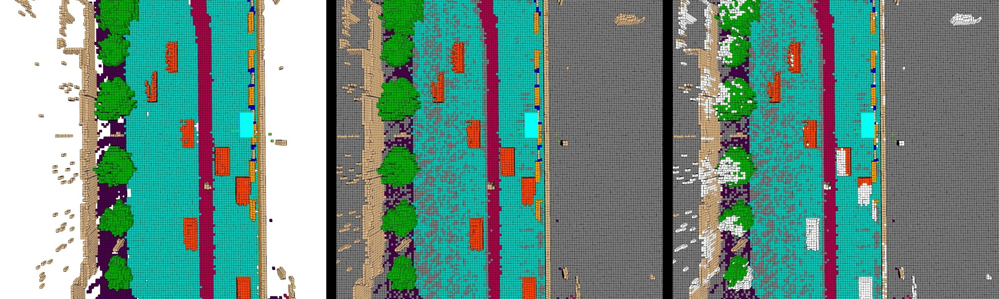

## nuScenes: A Multimodal Dataset for Autonomous Driving

https://www.youtube.com/watch?v=C6KbbndonGg

https://www.nuscenes.org/nuscenes#download

### Viz

- streetscape.gl
    - https://www.youtube.com/watch?v=irS9H0fU-ig
    - https://github.com/prodramp/DeepWorks/tree/main/selfdrivingtech/streetscape.gl_demo
- apollo-DreamView
    - https://github.com/ApolloAuto/apollo/tree/master/modules/dreamview
- Carla 
    - https://www.bilibili.com/video/BV1eN4y1Z7Zy
- lgsvl https://github.com/lgsvl/simulator
- Foxglove Studio https://github.com/foxglove/studio
    - https://github.com/foxglove/nuscenes2mcap

## Occ3D datasets

- Occ3D
- OpenOccupancy
- SurroundOcc

The stats of the dataset are summarized [here](dataset_stats.md).

|  Dataset  | Original Database |      Sensor Data (hr)    |   Flow | Semantic Categories                               |
|:---------:|:-----------------:|:--------------------:|:------:|:--------------------------------------------:|
| [MonoScene](https://github.com/astra-vision/MonoScene)  |      NYUv2 / SemanticKITTI     | 5 / 6  |  :x:     | 10 / 19   |
| [Occ3D](https://github.com/Tsinghua-MARS-Lab/Occ3D)   |      nuScenes / Waymo    | 5.5 / 5.7 |  :x:    | 16 / 14 |
| [Occupancy-for-nuScenes](https://github.com/FANG-MING/occupancy-for-nuscenes)   |      nuScenes     | 5.5  |  :x:     | 16  |
| [SurroundOcc](https://github.com/weiyithu/SurroundOcc)   |      nuScenes     | 5.5  |   :x:    | 16  |
| [OpenOccupancy](https://github.com/JeffWang987/OpenOccupancy)   |      nuScenes     | 5.5  |  :x:     | 16  |
| [SSCBench](https://github.com/ai4ce/SSCBench)   |      KITTI-360 / nuScenes / Waymo     | 1.8 / 4.7 / 5.6  |   :x:     | 19 / 16 / 14  |
| [OccNet](https://github.com/OpenDriveLab/OccNet)   |      nuScenes     | 5.5  |   :x:     | 16   |
| **OpenScene** |       nuPlan      | **:boom: 120**  |   **:heavy_check_mark:**    | **`TODO`** |

> - The time span of LiDAR frames accumulated for each occupancy annotation is **20** seconds.
> - Flow: the annotation of motion direction and velocity for each occupancy grid.
> - `TODO`: Full semantic labels of grids would be released in future version

### 3D Occupancy Prediction Challenge at CVPR 2023 (Server remains `active`)

Please refer to [this link](https://opendrivelab.com/AD23Challenge.html#Track3). If you wish to add new / modify results to the leaderboard, please drop us an email to <a href="mailto:contact@opendrivelab.com">contact@opendrivelab.com</a>
- Challenge webiste: [https://opendrivelab.com/AD23Challenge.html](https://opendrivelab.com/AD23Challenge.html)
  
Top 10 at a glance by June 10 2023. 

[CVPR2023 Occupancy Prediction比赛方案总结](https://mp.weixin.qq.com/s/dJXvkX-b6qiYe7dzB43FMQ)

## Task Definition

Given images from multiple cameras, the goal is to predict the current occupancy state and semantics of each voxel grid in the scene. The voxel state is predicted to be either free or occupied. If a voxel is occupied, its semantic class needs to be predicted, as well. Besides, we also provide a binary observed/unobserved mask for each frame. An observed voxel is defined as an invisible grid in the current camera observation, which is ignored in the evaluation stage.

### Rules for Occupancy Challenge

* We allow using annotations provided in the nuScenes dataset, and during inference, the input modality of the model should be camera only. 
* No future frame is allowed during inference.
* In order to check the compliance, we will ask the participants to provide technical reports to the challenge committee and the participant will be asked to provide a public talk about the method after winning the award.
* Every submission provides method information. We encourage publishing code, but do not make it a requirement.
* Each team can have at most one account on the evaluation server. Users that create multiple accounts to circumvent the rules will be excluded from the challenge.
* Each team can submit at most three results during the challenge. 
* Faulty submissions that return an error on Eval AI do not count towards the submission limit.
* Any attempt to circumvent these rules will result in a permanent ban of the team or company from the challenge.

(<a href="#top">back to top</a>)

## Evaluation Metrics

Leaderboard ranking for this challenge is by the intersection-over-union (mIoU) over all classes. 

### mIoU

Let $C$ be he number of classes. 

$$
    mIoU=\frac{1}{C}\displaystyle \sum_{c=1}^{C}\frac{TP_c}{TP_c+FP_c+FN_c},
$$

where $TP_c$ , $FP_c$ , and $FN_c$ correspond to the number of true positive, false positive, and false negative predictions for class $c_i$.

(<a href="#top">back to top</a>)

## Data

    

Figure 1. Semantic labels (left), visibility masks in the LiDAR (middle) and the camera (right) view. Grey voxels are unobserved in LiDAR view and white voxels are observed in the accumulative LiDAR view but unobserved in the current camera view.

Click [here](https://github.com/CVPR2023-3D-Occupancy-Prediction/CVPR2023-3D-Occupancy-Prediction/tree/main#basic-information) to see more details.

### Occupancy Datasets

+ Occ3D: A Large-Scale 3D Occupancy Prediction Benchmark for Autonomous Driving [[paper](https://arxiv.org/abs/2304.14365)] [[Github](https://github.com/Tsinghua-MARS-Lab/Occ3D)]
+ OpenOccupancy: A Large Scale Benchmark for Surrounding Semantic Occupancy Perception [[paper](https://arxiv.org/abs/2303.03991)] [[Github](https://github.com/JeffWang987/OpenOccupancy)]
+ SurroundOcc [[paper](https://arxiv.org/abs/2303.09551)] [[Github](https://github.com/weiyithu/SurroundOcc)]
+ Occupancy Dataset for nuScenes [[Github](https://github.com/FANG-MING/occupancy-for-nuscenes)]
+ SSCBench: A Large-Scale 3D Semantic Scene Completion Benchmark for Autonomous Driving [[paper](https://arxiv.org/abs/2306.09001)] [[Github](https://github.com/ai4ce/SSCBench)]
+ Scene as Occupancy [[paper](https://arxiv.org/abs/2306.02851)] [[Github](https://github.com/OpenDriveLab/OccNet)]