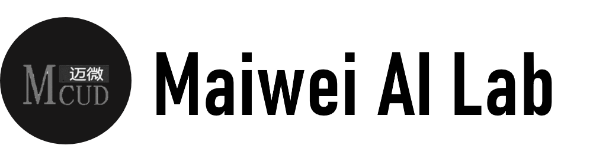

<code>文档</code>&nbsp;<code>源代码</code>&nbsp;<code>视频</code>&nbsp;<code>课后答疑</code>

# OccNet-Course

Surrounding Semantic Occupancy Perception Course for Autonomous Driving

<p align="center">
    
    From https://github.com/CVPR2023-3D-Occupancy-Prediction/CVPR2023-3D-Occupancy-Prediction
</p>

<br><br>

<!-- <table>
<tr>
	<td>
	## ✨ News! ✨

	- <b>2020.07.12:</b> 📝  进阶篇 更新Transformer、强化学习、迁移学习、视频理解 !
	- <b>2021.06.20:</b> 📘  在线电子书发布  ! <a href="https://charmve.github.io/computer-vision-in-action/" target="_blank"></a>
	- <b>2020.06.10:</b> 💻  OccNet-Course 项目主页发布 ！ <a href="https://charmve.github.io/L0CV-web/" target="_blank"></a>

	更多更新日志会同步到 [CHANGELOG](CHANGELOG.md)，持续更新中，感谢大家的支持与喜欢！
	</td>
</tr>
</table> -->

------

大家好！

欢迎来到《占据网络在自动驾驶中的应用》这门课程的学习，我是Charmve，大家也可以叫我察姆。目前任职于国内某自动驾驶独角兽公司，有多年自动驾驶量产经验。在本课程中，我们主要对今年国内外备受关注的Occupancy Network做一个专题学习分享，普遍认为它是解决自动驾驶感知长尾问题的关键技术。

特斯拉在去年AI DAY上，分享了他们在感知方面的一个重点技术：Occupancy Network (占据网络)，自此引发业内网对占据网络的关注。研究机器人技术的同学肯定对occupancy grid不会陌生，occupancy表示空间中每个3D体素（voxel）是否被占据，可以是0/1二元表示，也可以是[0, 1]之间的一个概率值。

为什么估计occupancy对自动驾驶感知很重要呢？很核心的一个原因是：车辆在行驶中，除了常见障碍物如车辆、行人，我们可以通过3D物体检测的方式来估计他们的位置和大小，还有更多长尾的障碍物也会对行驶产生重要影响。例如：

1. 可变形的障碍物，如两节的挂车，不适合用3D bounding box来表示；
2. 异形障碍物，如翻倒的车辆，3D姿态估计会失效；
3. 不在已知类别中的障碍物，如路上的石子、垃圾等，无法进行分类。

因此，我们希望能找到一种更好的表达来描述这些长尾障碍物，完整估计3D空间中每一个位置的占据情况（occupancy），甚至是语义（semantics）和运动情况（flow）。

特斯拉用下图的具体例子来展现Occupancy Network的强大。不同于3D的框，occupancy这种表征对物体没有过多的几何假设，因此可以建模任意形状的物体和任意形式的物体运动。图中展示了一个两节的公交车正在启动的场景，蓝色表示运动的体素，红色表示静止的体素，Occupancy Network精确地估计出了公交车的第一节已经开始运动，而第二节还处于静止状态。

<p align="center">
    
    <br> 图1 Tesla Occupancy Network
    <br> ▲对正在启动的两节公交车的occupancy估计，蓝色表示运动的体素，红色表示静止的体素
<p>

特斯拉的Occupancy Network 模型结构如下图所示。首先模型利用RegNet和BiFPN从多相机获取特征，然后模型通过带3D空间位置的spatial query对2D图像特征进行基于attention的多相机融合。如何实现3D spatial query和2D特征图之间的联系呢？具体融合的方式图中没有细讲，但最有可能采取的是两种方案：

- 第一种，叫做3D-to-2D query，即根据每个相机的内外参将3D spatial query投影到2D特征图上，提取对应位置的特征。该方法在DETR3D[1]中提出，BEVFormer[2]和PolarFormer[3]也采取了该思想。

- 第二种，是利用positional embedding来进行隐式的映射，即将2D特征图的每个位置加上合理的positional embedding，如相机内外参、像素坐标等，然后让模型自己学习2D到3D特征的对应关系，该方法在论文PETR中提出[4]。再接下来模型进行时序融合，实现的方法是根据已知的自车位置和姿态变化，将3D特征空间进行拼接。

不光是上述提到的BEVFormer、PETR算法，我们在本课程中会详细的分析、总结和对比不同算法之间的来龙去脉，各自发展的过程，核心思想和优化点。

这一工作的分享，激发了大家对自动驾驶感知算法方向的探讨，普遍认为占据网络是未来感知算法的终极解决方案 。通过稠密的空间体素占用确定自动驾驶车辆的感知结果，为预测和规划提供更加准备的条件。更加有利于特征时序融合、做到自动驾驶端到端的解决方案，最终实现L4，直至L5完全无人驾驶。

<p align="center">
    
    
    <br> 图2 空间占据预测示例（TPVFormer、OccFormer）
</p>

<h2 align="center">不知道怎么学习占据网络？学习难度大？</h2>

今年来，学术界和工业界都在视觉occupancy方面有了大量的工作，从纯视觉的方案到多传感器的方案、从前向预测到后向预测，再到最近提出的forward-backward联合方案。对于我们初学者，造成了极大的学习困难。一下子不知道如何下手，从哪开始。本课程的出发点就是为了解决这个痛点，应该算是国内外对于占据网络全面讲解的第一个课程或者专题内容。

在接下来的很长一段时间，我会从自动驾驶从业者的角度，跟大家一起学习和分享占据网络的发展及其算法原理，同时我们也提供了代码实践内容。以通俗的语言讲解从2D目标检测到BEV视角下的3D目标检测，再到3D空间占用算法的整个过程。并且尤其关注到算法原理本身，对比不同算法，详细分析其核心思想和各算法的优化点。更为特别的，在本课程中，我们会给出两个占据网络的复现和优化，让你快速复现，学以致用。尤其适合目前正在求职的朋友、对自动驾驶感知算法感兴趣的跨行就职者。每个章节都会有详细的课件和答疑群，欢迎大家一起交流！课程后，会有一个大作业，根据给出的条件和目标，思路提示，完成占据网络算法的优化，提升mIoU指标。

<p align="center">
  
  <br> 图3 课程源代码
</p>

<h2 align="center">课程特色</h2>
<p>

- 由浅入深，通俗易懂

作者根据多年的自动驾驶经验，从占据网络的发展过程详细的阐述从2D检测到BEV 3D检测再到占据网络，讲清楚为什么前一方法不适用，各自方法有什么局限性。占据网络的神力又在哪里？由浅入深，一个问题一个问题解答。

- Occ算法全覆盖，高度提炼

涵盖当前几乎所有的占据网络算法，融会贯通，总结和提炼各自算法的核心思想，引出新的思考。

- 理论结合实战

项目实战和理论结合，实战课程的课后配套实战代码和操作文档，随学随练、快速掌握。

</p>

[Index](#课程目录)

<h2 align="center">课程目录</h2>

#自动驾驶感知算法之占据网络专题#

<table>
  <tbody>
   <tr>
    <td>
    </td>
    <td>
        课程章节（点击标题展开章节详情🔎）
    </td>
    <td>
        课程视频
    </td>
    <td>
        课件PPT
    </td>
    <td>
        源代码
    </td>
   </tr>
   <tr>
    <td>
    <code>🔥 试看</code>
    </td>
    <td>
    <details><summary>一、BEV感知概述（3周）</summary>

[课程目录](Chapter01-BEV感知概述)
- 1.1 课程介绍和内容设计
- 1.2 BEV感知算法的基本介绍
- 1.3 相比于PV视角的差异性
- 1.4 BEV和OccNet的联系
- 1.5 主流的方法一览（2周）
   - 1.5.1 LSS
   - 1.5.2 BEVDet
   - 1.5.3 BEVFormer
   - 1.5.4 DETR3D
   - 1.5.5 FUTR3D
    </details>
    </td>
    <td>
	[<a href="Chapter01-BEV感知概述/占据网络专题-第一章-BEV感知概述.pptx"><code>📹</code> Video</a>] | [<code></code><a href="https://pan.baidu.com/s/19fptO0aUjMXlJNM2jVn_qQ">百度网盘</a>] 提取码: qnq1
    </td>
    <td>
      [PPT]() | [百度网盘]
    </td>
    <td>
    </td>
   </tr>
   <tr>
    <td>
    <code>🔥 试看</code>
    </td>
    <td>
    <details><summary>二、占据栅格网络概述(1.5周)</summary>

[课程目录](Chapter02-占据栅格网络概述)
- 2.1 3D语义场景补全（SSC）介绍
- 2.2 占据网络基本思路
- 2.3 纯视觉和多模态分类
  - 2.3.1 纯视觉方案
  - 2.3.2 点云方案
- 2.4 Occpuancy网络基本流程梳理
- 2.5 优势与挑战
    </details>
    </td>
    <td>
     [<a href="Chapter02-占据栅格网络概述/占据网络专题-第二章-占据网络概述.mp4"><code>📹</code> Video</a>] | [<code></code><a href="https://pan.baidu.com/s/1flYKlkQ-zMMQUjY6aHIeyA">百度网盘</a>] 提取码: p8cn
    </td>
    <td>
      [PPT]() | [百度网盘]()
    </td>
    <td>
    </td>
   </tr>
   <tr>
    <td>
    </td>
    <td>
    <details><summary>三、重要数据集和Benchmark介绍（1周）</summary>

[课程目录](Chapter03-重要数据集和Benchmark介绍)
- 3.1. 主流数据集介绍
  - 3.1.1 nuScenes
  - 3.1.2 SemanticKITTI
- 3.2. Benchmark对比
  - 3.2.1 指标介绍
  - 3.2.2 当前现状
- 3.3. 主要的竞赛Challenge介绍
</details>
    </td>
    <td>
     [📹 Video] | [百度网盘]()
    </td>
    <td>
      [PPT]() | [百度网盘]()
    </td>
    <td>
    </td>
   </tr>
   <tr>
    <td>
    </td>
    <td>
    <details><summary>四、基于纯视觉的Occ算法（6周）</summary>

[课程目录](Chapter04-基于纯视觉的Occ算法)
- 4.1 纯视觉方法概括
- 4.2 多目相机方案（3周）
  - 4.2.1 方案概述
  - 4.2.2 TPVFormer 
  - 4.2.3 OccFormer
  - 4.2.4 OccDepth
  - 4.2.5 voxformer
  - 4.2.6 Occ-BEV
  - 4.2.7 BEV-IO
  - 4.2.8 SurroundOcc
  - 4.2.9方法对比
  - 4.2.10代码实战（1周）
- 4.3 单目相机方案（2周）
  - 4.3.1 方法概述
  - 4.3.2 单目相机3D检测
    - 4.3.2.1 PGD
    - 4.3.2.2 SMOKE
    - 4.3.2.3 Monoflex
    - 4.3.2.4 FCOS3D
  - 4.3.3 单目相机Occ代表工作
    - 4.3.3.1 MonoScene 原理
    - 4.3.3.2 StereoScene 原理
  - 4.3.4 方法对比
  - 4.3.5 代码实战
</details>
    </td>
    <td>
      [📹 Video] | [百度网盘]()
    </td>
    <td>
      [PPT]() | [百度网盘]()
    </td>
    <td>
    </td>
   </tr>
   <tr>
    <td>
    </td>
    <td>
    <details><summary>五、基于点云和多模态融合的Occ方案（4周）</summary>

[课程目录](Chapter05-基于点云和多模态融合的Occ方案)
- 5.1 多模态方式Occ概述
- 5.2 点云3D检测网络介绍（1.5周）
  - 5.2.1 VoxelNet
  - 5.2.2 PointPillar
- 5.3  BEV下的3D点云感知（2周）
  - 5.3.1 FastPillars
  - 5.3.2 SECOND
  - 5.3.3 OpenOccupancy
- 5.4 方案对比
</details>
    </td>
    <td>
     [📹 Video] | [百度网盘]()
    </td>
    <td>
      [PPT]() | [百度网盘]()
    </td>
    <td>
    </td>
   </tr>
   <tr>
    <td>
    </td>
    <td>
    <details><summary>六、占据网络部署小试（1.5周）</summary>

[课程目录](Chapter06-占据网络部署小试)
- 6.1 Cuda 基本概述
- 6.2 TensorRT 基本概述
- 6.3 BEVFormer 部署实战
- 6.4 VoxFormer 部署实战
</details>
    </td>
    <td>
     [📹 Video] | [百度网盘]
    </td>
    <td>
    </td>
    <td>
    </td>
   </tr>
   <tr>
    <td>
    </td>
    <td>
    <details><summary>七、课程展望与总结（1周）</summary>

[课程目录](Chapter07-课程展望与总结)
- 7.1 Occ应用Nerf的一些思考
- 7.2 基本现状和发展趋势
</details>
    </td>
    <td>
     [📹 Video] | [百度网盘]
    </td>
    <td>
    </td>
    <td>
    </td>
   </tr>
   <tr>
    <td>
    </td>
    <td>
    <details><summary>八、大作业(实践内容)（2周）</summary>

[课程目录](Chapter08-FinalProject)
- 8.1 复现一个纯视觉方案，走通数据标定、3D目标检测、BEV视角坐标对齐、3D语义场景补全补全完整流程。
- 8.2 参考答案
</details>
    </td>
    <td>
     [📹 Video] | [百度网盘]
    </td>
    <td>
      [PPT]() | [百度网盘]
    </td>
    <td>
    </td>
   </tr>
   <tr>
    <td>
    <code>🔥 试看</code>
    </td>
    <td>
    <details><summary>九、补充材料（1周）</summary>

[课程目录](Chapter09-Appendix)
- 9.1 Transformer in Vision
- 9.2 BEV+Transformer
- 9.3 E2E、LLM、Data-driven
</details>
    </td>
    <td>
     [📹 Video] | [百度网盘]
    </td>
    <td>
    </td>
    <td>
    </td>
   </tr>
   <tr>
    <td></td>
    <td>
    <details><summary>🎉 课程彩蛋</summary>
    <code>这是一个彩蛋 🥚</code>
</details>
    </td>
    <td>
    </td>
    <td>
    </td>
    <td>
    </td>
   </tr>
  </tbody>
</table>

<h3>课前预习材料</h3>

<code>已建立微信交流群，微信 <samp>Yida_Zhang2</samp></code>

- [论文一作李志琦解读BEVFormer： 基于Transformer的自动驾驶BEV纯视觉感知，CVPR2022 workshop，代码刚开源](https://www.bilibili.com/video/BV1PF411c78z/?spm_id_from=333.337.search-card.all.click&vd_source=57394ba751fad8e6886be567cccfa5bb)
- [环视BEV感知：下一代自动驾驶感知算法新范式，BEVFormer、BEVFormer++、BEVFusion等系列算法分享](https://www.bilibili.com/video/BV1A34y1W7Lu/?spm_id_from=333.337.search-card.all.click&vd_source=57394ba751fad8e6886be567cccfa5bb)
- [CVPR23 | 3D Occupancy 预测冠军方案：FB-OCC](https://www.bilibili.com/video/BV1PX4y1e7zz/?vd_source=57394ba751fad8e6886be567cccfa5bb)
- [CVPR2023 Occupancy Prediction比赛方案总结](https://mp.weixin.qq.com/s/dJXvkX-b6qiYe7dzB43FMQ)
- [迈向BEV的大一统 | 基于纯视觉策略的BEV感知](https://mp.weixin.qq.com/s/43sQJtblSOILLWBr46oMVw)
- [BEVFusion+BEVFormer讲解](https://www.bilibili.com/video/BV1Eg4y1A7JD/?spm_id_from=333.337.search-card.all.click&vd_source=57394ba751fad8e6886be567cccfa5bb)
- 有基础的同学，可进一步看本课程的[补充材料](Chapter09-Appendix)

## Quick-start

```bash
git clone https://github.com/Charmve/OccNet-Course ～/mway
cd ～/mway/OccNet-Course

scripts/start_dev_docker.sh
scripts/goto_dev_docker.sh

cd Chapter07-FinalProject/OccNet
```

<h2 align="center">课件代码一应俱全</h2>

细致的讲解，不光要有理论，代码及实践也一定要讲透彻！通过全套的视频讲解，帮你在脑海中搭建模型的基本框架，彻底搞懂每一个知识点，从而提高写代码的效率和速度。

<div align="center">
  <p>
    
    <br> 图4 课程源代码
  </p><br>
  <p>
    
    <br> 图5 课件PPT
  </p>
</div>

[Index](#课程目录)

<h2 align="center">讲师介绍</h2>

我是 <a href="https://github.com/Charmve">Charmve</a>，在多家自动驾驶头部公司任职，主要关注在BEV视觉感知、3D场景重建，有多个自动驾驶量产项目经验。近年来，尤其关注在占据网络的研发上，根据个人所学所思和工作实践，跟大家一起分享这个主题内容。

[Index](#课程目录)

<h2 align="center">课程学后收获</h2>
<p>

1. 对占据网络有较为全面的认识，深入理解各种算法的核心思想和原理，尽可能做到融会贯通，结合实际工作，改善和提高系统感知能力；
2. 对自动驾驶系统的感知算法会有较深入的理解，掌握感知算法的设计痛点和难点；
3. 学完本课程，并理解本课程所讲解的内容，你将会是占据网络掌握的少数人！
4. 提高从业竞争力，卷过同级身边人，同时也能够结识许多行业从业人员与学习合作伙伴！

</p>

[Index](#课程目录)

<h2 align="center">适合人群</h2>
<p>

1. 计算机视觉与自动驾驶感知相关研究方向的本科/硕士/博士；
2. CV与自动驾驶2D/3D感知相关算法工程人员；
3. 对占据网络算法感兴趣的朋友，要是有实际需求会更好；
4. 对计算机视觉有部分了解，具有一定的Python、Pytorch基础的小伙伴；

</p>

[Index](#课程目录)

<h2 align="center">开课时间与学习方式</h2>

2023年11月份开始学习之路，历经两个月，离线视频授课。主讲老师在微信学习群内答疑，对课程中的算法、代码、环境配置等问题一一解惑！

[Index](#课程目录)

<h2 align="center">课程咨询与购买</h2>

课程采用预售方式，本仓库star数超过1k，或预定人数超过100人后，将会上线全部课程和源代码。

<div align="center">
<p>
  <kbd align="center" valign="center">
    
    VIP 专享<u><b>8折</b>优惠券</u>
    
  </kbd>
</p>

<p>
  扫码学习课程<br>

  
  <br>
  微信咨询：Charmve
</p>
</div>

[Index](#课程目录)

<br><br>

## Acknowledge

Some benchmark result and soure code from: https://github.com/CVPR2023-3D-Occupancy-Prediction/CVPR2023-3D-Occupancy-Prediction


